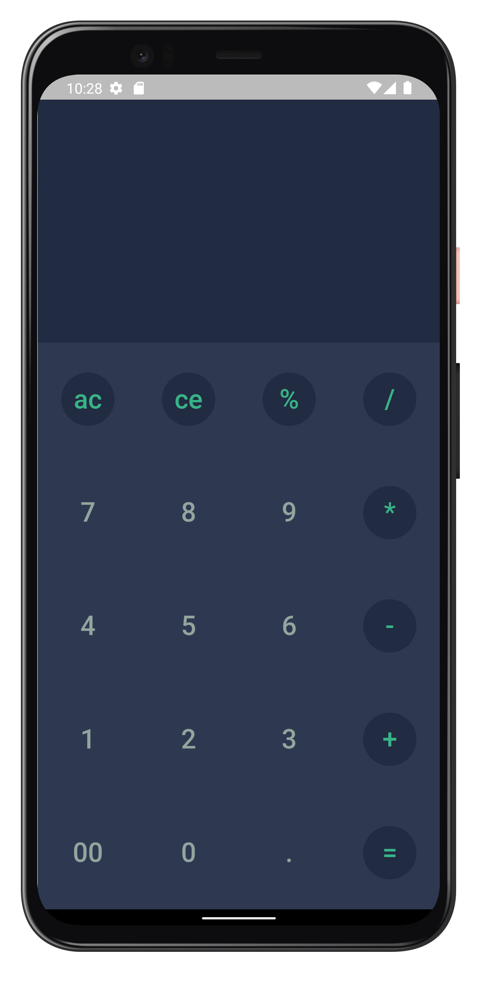
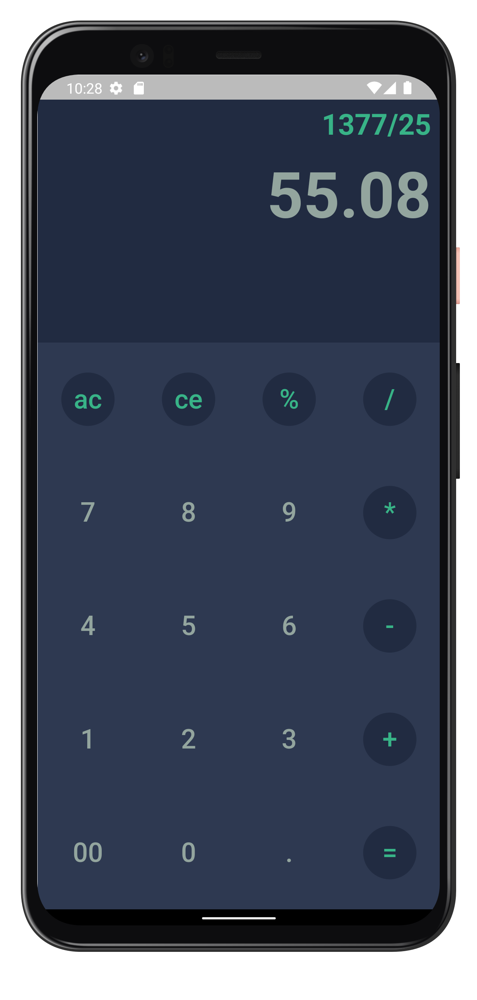

# calculator
- Use StateFull Widget
- Use Column Widget
- Use Container Widget
- Use Padding Widget
- Use Row Widget
- Use Function isOperator
- Use Background Color for Operator  
- <a href="https://cafebazaar.ir/app/com.omid.calculator.calculator">For installation, visit Cafe Bazaar</a> 
  

